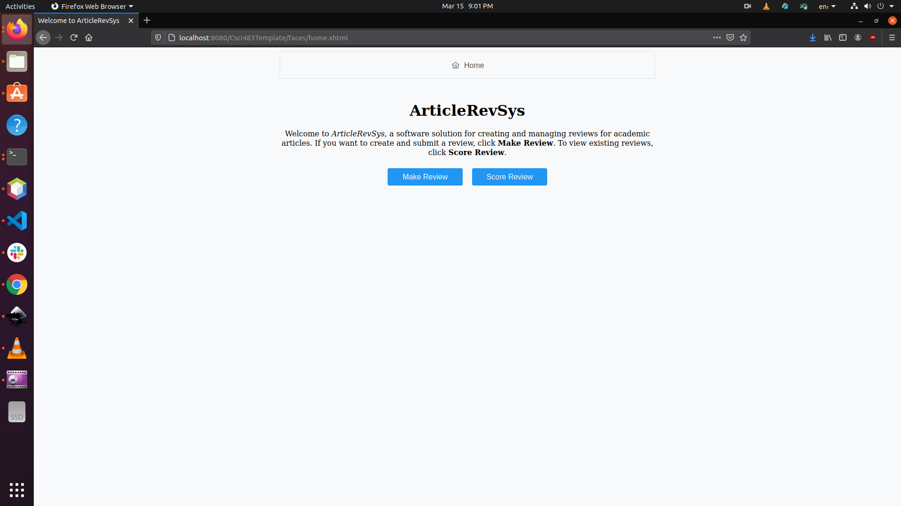
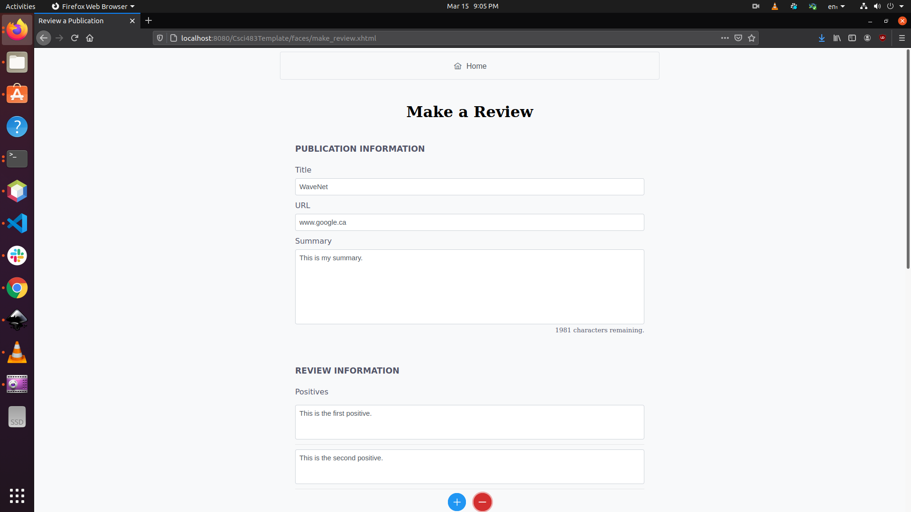
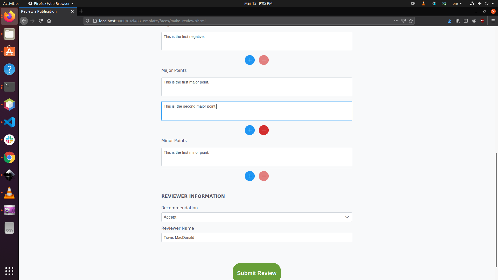
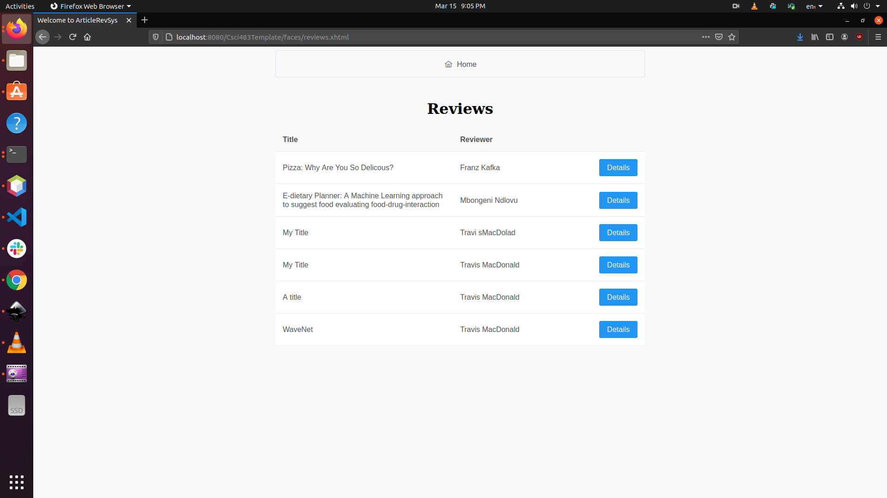
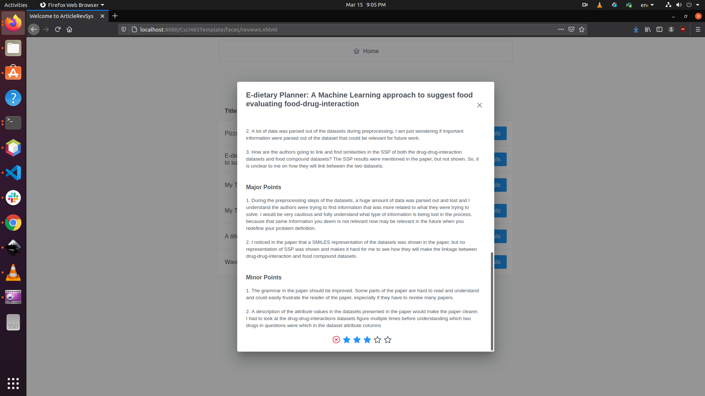

# ArticleRevSys

An application for reviewing scientific articles. Provides two main functionality for users:

1. Review a publication.
2. Score reviews.

# Setup

Follow these steps to setup the project.

## Dependencies

1. MySQL.

## Steps

1. Clone project.
2. Build project to download dependencies.
3. Build MySQL database using [`setup.sql`](mysql_queries/setup.sql) (paste into MySQL terminal).
4. Update MySQL username and password in [`ArsRepository.java`](src/main/java/com/travismacdonald/articlerevsys/model/ArsRepository.java) to match your own values (lines 27-28).
5. Run in Mozilla*.

\*Website was built using Mozilla. Some features are buggy on Chrome.

# Design Decisions

This application contains some relatively arbitrary design decisions including:

| Field         | Character Limit (each) | Max Points | Min Points |
| ------------- |:---------------:|:----------:|:----------:|
| Title         | 100             | N/A        | N/A        |
| URL           | 100             | N/A        | N/A        |
| Summary       | 2000            | N/A        | N/A        |
| Positives     | 500             | 5          | 1          |
| Negatives     | 500             | 5          | 1          |
| Major Points  | 1000            | 5          | 1          |
| Minor Points  | 500             | 5          | 1          |
| Reviewer Name | 100             | N/A        | N/A        |

The reason for implemented this is to enforce *some* limit on the amount of information that a reviewer can upload. However, it should be noted that this application was designed so that these can be easily modified and/or removed (e.g. ArsConstants can be modified to change global behavior of the entire application).

# Pages

## Home Page

## Make Review Page

## Score Review Page

